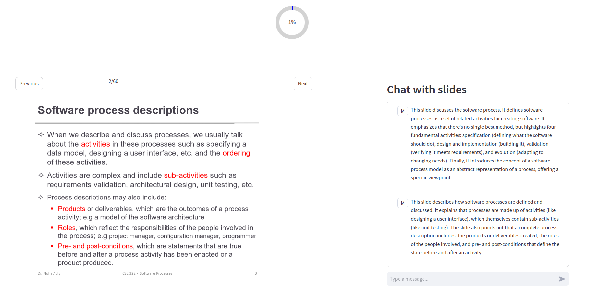

# CSED Slider
## Description 📚
This is a study agent to help students, mainly was for CSED (Computer & Systems Engineering) at Alexandria University, to explain the slides of lectures. Main goal is to make it easy and quick to understand the slides and to help students to study the slides in a more interactive way.

## Features ✨
- **Slide Explanation**: The agent will explain the slide to the student slide by slide.
- **Slide Chat**: The student can ask the agent about the slide content.
- **Slide Quiz**: The agent will ask the student questions about the slide content. This will help the student to understand the slide content.
- **Slide Progress**: The student can know how many slides he/she has studied and how many slides are remaining.
- **Slide Navigation**: The student can navigate between slides.

## Installation 🛠️
1. Clone the repository.
2. Install the required packages using the following command:
```bash
pip install -r requirements.txt
```
3. Run the following command to start the agent:
```bash
streamlit run main.py
```

## Usage 🚀
1. Open the browser and go to the following link: http://localhost:8501
2. Upload the slides you want to study.
3. Add your google API key to the agent. [How to get a Gemini API key](https://youtu.be/OVnnVnLZPEo?si=Vi7EAf0nOhUeOUyK)
4. Start Lecture 🎉

<!-- ## Demo 🎥
[](https://www.youtube.com/watch?v=1Q8J9J9Q1Z0) -->

## Future Work 🚀
- **More interactive quizzes**: Add more interactive ways to help students understand the slides.
- **PDF feature**: Add the ability to search for a specific word in the slides.
- **Voice feature**: Add the ability to explain the slides using voice.

## Finally 📌
I hope this will give you better study experience 🌟

